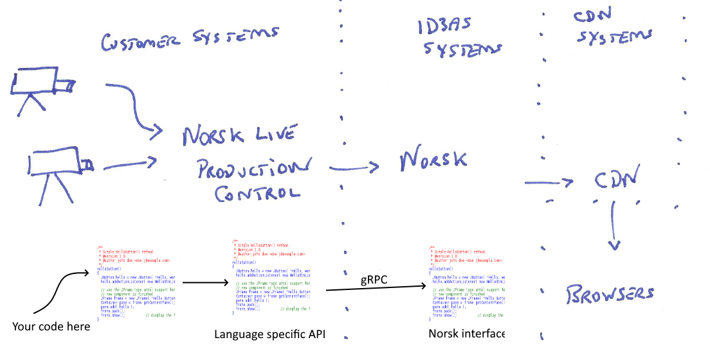

Introduction to Norsk
=====================

Norsk™ is a gRPC-based server that can be controlled by simple code, written in a language of your choice, to perform rich, real-time manipulation of live media streams.

Norsk-Live refers to client-side code that consists of

* An API.
* Client code that determines the behaviour of streaming events - completely owned and controlled by you
* For some languages, such as TypeScript, an SDK to provide helper functions over the API.  Who will own this? tk

This guide describes how to build such applications. Examples are in TypeScript, and a schematic of where Norsk-Live fits in is below.

