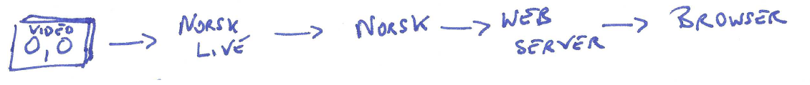

== A Basic Norsk workflow

A basic Norsk workflow is illustrated below

In this scenario, we have

* A static video file which can be replayed as if a live stream source
* A web server that can stream the video over websockets to a browser
* A video friendly bowser
* A Norsk server that encodes the video stream according to specifications made in a Norsk-Live app
* A Norsk-Live app, which we are about to look at

See this xref:NodeSettings.adoc[Setting up a Norsk playground] for instructions on setting up a Norsk-playground if you want to build this application yourself.

Assuming that 
    * A Norsk server is available at a known ip address (in the example code it is stored in an environment variable)
    * An rtmp video source is being streamed to a known ip address (in the example it is passed into the function as argv.port)

.. then the following code will execute the illustrated workflow

[source,TypeScript]
----
async function rtmp_to_rtc(argv: Arguments): Promise<void> {
    //config for the input stream
    let rtmpSettings = { id: "rtmpInput", port: argv.port };  

    //config for the web server that Norsk will create as a test delivery endpoint
    let localRtcSettings = { id: "localRtcOutput", numVideoStreams: 1 }; 

    // Connect to the Norsk server
    const norsk = new Norsk(`localhost:${process.env.PORT}`);

    // tell Norsk that we have an input stream for it to deliver.  Norsk returns a handle to that input
    let input = await norsk.input.rtmpServer(rtmpSettings);

    // tell Norsk to create its own web server to handle an rtc stream
    let localRtcOutput = await norsk.output.localWebRTC(localRtcSettings);

    // connect the web server receiver to the video input --BUT see note on sourceSelector
    localRtcOutput.subscribe([{ source: input, sourceSelector: selectAV }]);
}
----

That's nearly the whole story.  What is missing is the code that Norsk-Live needs to implement in order to tell the Norsk Server which streams to pass on to the delivery target (in this case the RTC Web Server).  This code is given to Norsk as a callback specified by the sourceSelector attribute, which is described in the next page.
