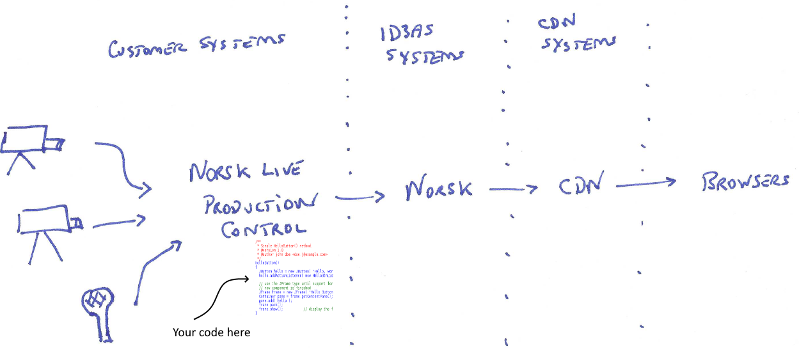

Norsk User Guide
================

:plus: &#43;

[.text-center]
****
'An introduction to creating live-streaming applications using Norsk Live'
****

The schematic below shows a simplified view of a streaming event, where video and audio are captured by a number of recording devices, pass through a Norsk-Live application, and are then processed and delivered to locations specified in that application.  Norsk-Live applications are based on an API that provides various streaming serviecs, but which otherwise consists of code owned and controlled by Norsk customers.  This guide describes how to build such applications.

